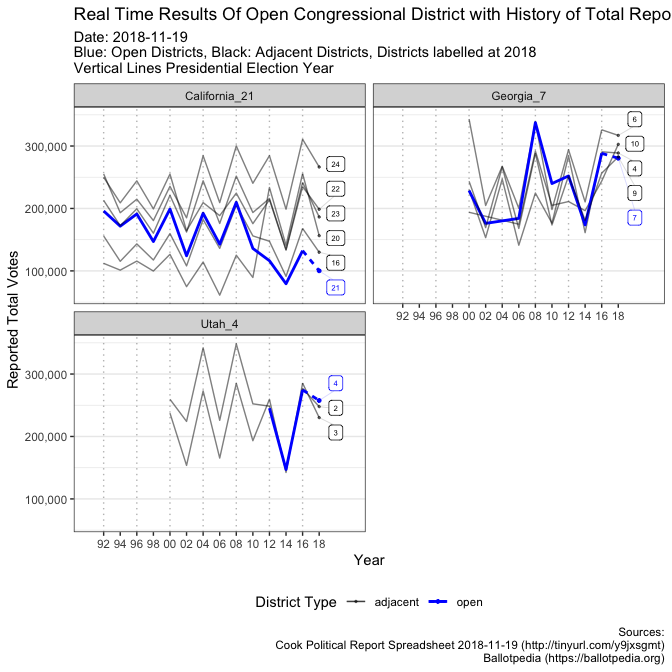

<!-- README.md is generated from README.Rmd. Please edit that file -->

# cookr

The goal of cookr is to track in real time the results of the 2018 US
congressional election by district using a live [google
spreatsheet](https://docs.google.com/spreadsheets/d/1WxDaxD5az6kdOjJncmGph37z0BPNhV1fNAH_g7IkpC0/htmlview?sle=true#gid=326900537)
populated by [Cook political report](https://www.cookpolitical.com/),
and add historical context of reported results using
[Ballotpedia](https://ballotpedia.org/).

The package locates which districts are still active and searches for
adjacent districts to get their restults too, using this [geojson
file](https://gist.githubusercontent.com/mbostock/4090846/raw/d534aba169207548a8a3d670c9c2cc719ff05c47/us-congress-113.json).

In the package there is a plotting function to vizualize the time
depedent results. To create an output like this


Sticking a pin in this is to have data to model in the future expected
voter turnout with higher frequency data.

## Installation

You can install cookr from github with:

``` r
# install.packages("remotes")
remotes::install_github("yonicd/cookr")
```

## Usage

### Load Library

``` r
library(cookr)
```

### Fetching The Spreadsheet

``` r
cook_html <- httr::GET('https://docs.google.com/spreadsheets/d/1WxDaxD5az6kdOjJncmGph37z0BPNhV1fNAH_g7IkpC0/htmlview?sle=true#gid=326900537')
```

``` r
cook_data <- cook_html%>%
  cookr::fetch_spreadsheet()
```

Peek at Data

``` r
cook_data%>%
  dplyr::glimpse()
#> Observations: 435
#> Variables: 18
#> $ `1`                   <int> 4, 5, 6, 7, 8, 9, 10, 11, 12, 13, 14, 15...
#> $ State                 <chr> "Alabama", "Alabama", "Alabama", "Alabam...
#> $ district              <chr> "1", "2", "3", "4", "5", "6", "7", "AL",...
#> $ `2018 Cook PVI Score` <chr> "R+15", "R+16", "R+16", "R+30", "R+18", ...
#> $ `2018 Winner`         <chr> "Bradley Byrne", "Martha Roby", "Mike Ro...
#> $ Party                 <chr> "R", "R", "R", "R", "R", "R", "D", "R", ...
#> $ `Dem Votes`           <chr> "88,365", "86,581", "83,748", "46,370", ...
#> $ `GOP Votes`           <chr> "152,308", "138,582", "147,481", "183,95...
#> $ `Other Votes`         <chr> "157", "419", "149", "222", "221", "137"...
#> $ `Dem %`               <chr> "36.7%", "38.4%", "36.2%", "20.1%", "38....
#> $ `GOP %`               <chr> "63.2%", "61.4%", "63.7%", "79.8%", "61....
#> $ `Other %`             <chr> "0.1%", "0.2%", "0.1%", "0.1%", "0.1%", ...
#> $ `Dem Margin`          <chr> "-26.6%", "-23.1%", "-27.5%", "-59.7%", ...
#> $ `2016 Clinton Margin` <chr> "-29.2%", "-31.7%", "-33.0%", "-62.5%", ...
#> $ `Swing vs. 2016 Prez` <chr> "2.6%", "8.6%", "5.5%", "2.8%", "10.7%",...
#> $ `Raw Votes vs. 2016`  <chr> "78.8%", "78.4%", "79.4%", "78.7%", "82....
#> $ `Final?`              <chr> "", "", "", "", "", "", "", "", "", "", ...
#> $ state_district        <chr> "Alabama_1", "Alabama_2", "Alabama_3", "...
```

Filter to open districts

``` r
open_districts <- cook_data%>%
  cookr::cook_open()
```

| State      | district | Dem Votes | GOP Votes | Dem Margin |  total | type |
| :--------- | :------- | --------: | --------: | ---------: | -----: | :--- |
| California | 21       |     48997 |     51175 |     \-2178 | 100172 | open |
| Georgia    | 7        |    140011 |    140430 |      \-419 | 280441 | open |
| Utah       | 4        |    128587 |    129006 |      \-419 | 257593 | open |

Find the adjacent districts

``` r
adjacent_districts <- open_districts%>%
  cookr::cook_adjacent()
```

Combine
Data

``` r
districts <- dplyr::bind_rows(open_districts,adjacent_districts)
```

$California\_21

| State      | district | Dem Votes | GOP Votes | Dem Margin |  total | type     |
| :--------- | :------- | --------: | --------: | ---------: | -----: | :------- |
| California | 21       |     48997 |     51175 |     \-2178 | 100172 | open     |
| California | 16       |     73352 |     56543 |      16809 | 129895 | adjacent |
| California | 20       |    156467 |         0 |     156467 | 156467 | adjacent |
| California | 22       |     92462 |    106240 |    \-13778 | 198702 | adjacent |
| California | 23       |     65717 |    120687 |    \-54970 | 186404 | adjacent |
| California | 24       |    154575 |    111870 |      42705 | 266445 | adjacent |

$Georgia\_7

| State   | district | Dem Votes | GOP Votes | Dem Margin |  total | type     |
| :------ | :------- | --------: | --------: | ---------: | -----: | :------- |
| Georgia | 7        |    140011 |    140430 |      \-419 | 280441 | open     |
| Georgia | 4        |    227706 |     61092 |     166614 | 288798 | adjacent |
| Georgia | 6        |    160134 |    156874 |       3260 | 317008 | adjacent |
| Georgia | 9        |     57912 |    224661 |   \-166749 | 282573 | adjacent |
| Georgia | 10       |    112325 |    190389 |    \-78064 | 302714 | adjacent |
| Georgia | 11       |    118650 |    191885 |    \-73235 | 310535 | adjacent |

$Utah\_4

| State | district | Dem Votes | GOP Votes | Dem Margin |  total | type     |
| :---- | :------- | --------: | --------: | ---------: | -----: | :------- |
| Utah  | 4        |    128587 |    129006 |      \-419 | 257593 | open     |
| Utah  | 2        |    100285 |    147556 |    \-47271 | 247841 | adjacent |
| Utah  | 3        |     65456 |    164755 |    \-99299 | 230211 | adjacent |

Fetch Historical Results of the Districts From Ballotpedia

``` r
cook_history <- districts%>%
  cook_ballotpedia()
```

$California\_21

| State      | district | Dem Votes | GOP Votes | Dem Margin |  total | type     |  slack\_q05 | slack\_q50 | slack\_q95 |
| :--------- | :------- | --------: | --------: | ---------: | -----: | :------- | ----------: | ---------: | ---------: |
| California | 21       |     48997 |     51175 |     \-2178 | 100172 | open     |     3193.90 |    59134.0 |  104960.40 |
| California | 16       |     73352 |     56543 |      16809 | 129895 | adjacent |  \-27777.10 |    21771.5 |   60452.10 |
| California | 20       |    156467 |         0 |     156467 | 156467 | adjacent |  \-86474.50 |  \-41496.5 |   84875.15 |
| California | 22       |     92462 |    106240 |    \-13778 | 198702 | adjacent |  \-45247.05 |    10494.0 |   53024.40 |
| California | 23       |     65717 |    120687 |    \-54970 | 186404 | adjacent |  \-35258.85 |    10081.0 |   60514.85 |
| California | 24       |    154575 |    111870 |      42705 | 266445 | adjacent | \-147530.50 |  \-77352.5 |   32829.15 |

$Georgia\_7

| State   | district | Dem Votes | GOP Votes | Dem Margin |  total | type     | slack\_q05 | slack\_q50 | slack\_q95 |
| :------ | :------- | --------: | --------: | ---------: | -----: | :------- | ---------: | ---------: | ---------: |
| Georgia | 7        |    140011 |    140430 |      \-419 | 280441 | open     | \-105913.8 |    \-46202 |    39847.8 |
| Georgia | 4        |    227706 |     61092 |     166614 | 288798 | adjacent | \-142821.2 |    \-64104 |    \-793.8 |
| Georgia | 6        |    160134 |    156874 |       3260 | 317008 | adjacent | \-117934.4 |    \-49389 |    24177.0 |
| Georgia | 9        |     57912 |    224661 |   \-166749 | 282573 | adjacent | \-114103.2 |    \-39042 |   \-3222.6 |
| Georgia | 10       |    112325 |    190389 |    \-78064 | 302714 | adjacent | \-122217.2 |    \-97747 |  \-25264.4 |

$Utah\_4

| State | district | Dem Votes | GOP Votes | Dem Margin |  total | type     | slack\_q05 | slack\_q50 | slack\_q95 |
| :---- | :------- | --------: | --------: | ---------: | -----: | :------- | ---------: | ---------: | ---------: |
| Utah  | 4        |    128587 |    129006 |      \-419 | 257593 | open     | \-100614.1 |    \-12316 |    14046.8 |
| Utah  | 2        |    100285 |    147556 |    \-47271 | 247841 | adjacent |  \-70559.2 |       4438 |    97941.2 |
| Utah  | 3        |     65456 |    164755 |    \-99299 | 230211 | adjacent |  \-83373.8 |       7137 |    54999.6 |

### Plotting

``` r
p <- cook_history%>%
  cook_plot()
#> Warning: Using alpha for a discrete variable is not advised.
#> Warning: Using size for a discrete variable is not advised.

p
```

<!-- -->

### Saving

``` r
ggplot2::ggsave(p,filename = sprintf('plots/cook_%s.png',strftime(Sys.Date(),format = '%Y_%m_%d')))

saveRDS(cook_html,file = sprintf('src_data/cook_spreadsheet_%s.rds',strftime(Sys.Date(),format = '%Y_%m_%d')))
saveRDS(cook_history,file = sprintf('src_data/cook_history_%s.rds',strftime(Sys.Date(),format = '%Y_%m_%d')))
```
